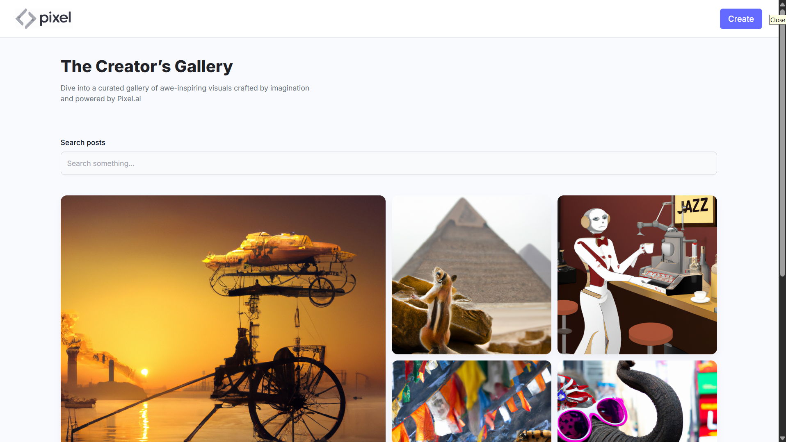
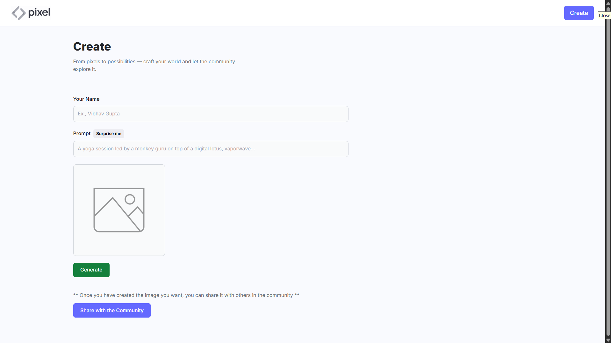

# 🎨 Pixel.ai : AI Image Generator

A fully functional **AI Image Generation Platform** powered by **OpenAI** and built using the **MERN Stack (MongoDB, Express, React, Node.js)**. Pixel.ai lets users generate high-quality images from text prompts using a modern and intuitive UI. It supports "Surprise Me" prompts, a **Creators' Gallery** for community showcase, and easy image downloads — all in real-time.


---

## 📸 App Snapshots

<p align="center">
  
  <br/><em>🏠 Homepage featuring the Creators' Gallery for community showcase</em><br/><br/>

  
  <br/><em>✨ Create Post page with "Surprise Me" prompt generator</em><br/><br/>
</p>

---

## 🔥 Features

### ✨ Core Features
- Generate AI-based images using text prompts
- "🎲 Surprise Me" button for creative inspiration
- Download generated images in a single click

### 🌐 Community Features
- Share creations to the **Creators’ Gallery**
- Explore images generated by other users
- View details of each post

### 💻 Tech Highlights
- Real-time image generation with OpenAI API
- Responsive UI using **Tailwind CSS**
- RESTful API integration with secure backend
---

## 🛠️ Tech Stack

### 🔮 Frontend
- ⚛️ React + Vite
- 💅 Tailwind CSS

### 🧠 Backend
- 🟢 Node.js + Express.js
- 🧩 MongoDB + Mongoose
- 🤖 OpenAI API for image generation

---

## 📁 Folder Structure

```
Pixel.ai/
├── .env                     # Environment config

├── server/
│   ├── index.js             # Express server entry point
│   ├── package.json         # Backend dependencies
│   ├── routes/
│   │   ├── dalleRoutes.js  # Route for image generation
│   │   └── postRoutes.js    # Route for image posts
│   ├── mongodb/
│   │   └── connect.js       # MongoDB connection logic
│   ├   models/
│   │   └── post.js          # Mongoose schema for posts
│
│
│
├── client/
│   ├── index.html           # Main HTML template
│   ├── vite.config.js       # Vite configuration
│   ├── tailwind.config.js   # Tailwind CSS configuration
│   ├── postcss.config.js    # PostCSS config
│   ├── src/
│   │   ├── App.jsx
│   │   ├── main.jsx
│   │   ├── pages/           # Home.jsx, CreatePost.jsx
│   │   ├── components/      # Card.jsx, FormField.jsx, Loader.jsx
│   │   └── utils/           # Surprise Me Prompts

├── screenshots/             # App screenshots
├── README.md
└── LICENSE

```


---

## 🚀 Getting Started

### 1️⃣ Clone the Repository

```bash
git clone https://github.com/vibhav30/Pixel.ai.git
cd Pixel.ai
```

### 2️⃣ Install Dependencies

**Backend:**

```bash
cd server
npm install
```

**Frontend:**

```bash
cd ../client
npm install
```

---

## 🔧 Configuration

Create a `.env` file inside the `server` folder:

```env
OPENAI_API_KEY=your_openai_api_key
MONGODB_URL=your_mongodb_connection_string
CLOUDINARY_CLOUD_NAME=your_cloudinary_cloud_name
CLOUDINARY_API_KEY=your_cloudinary_api_key
CLOUDINARY_API_SECRET=your_cloudinary_api_secret
```

---

## ▶️ Running the App

### Start Backend

```bash
cd server
npm start
```

### Start Frontend

```bash
cd client
npm run dev
```

Frontend runs at: `http://localhost:5173`  
Backend runs at: `http://localhost:8080`

---

## 🙌 Contributing

Contributions are what make the open-source community such an amazing place to learn and grow. Feel free to fork the project and open a pull request.

1. Fork the project  
2. Create your feature branch (`git checkout -b feature/AmazingFeature`)  
3. Commit your changes (`git commit -m 'Add some AmazingFeature'`)  
4. Push to the branch (`git push origin feature/AmazingFeature`)  
5. Open a Pull Request  

---

## 🪪 License

Distributed under the MIT License. See `LICENSE` for more information.

---

## 📬 Contact

**Created by Vibhav Gupta**  
Email: [guptavibhav123@gmail.com]  
GitHub: [https://github.com/vibhav30](https://github.com/vibhav30)
